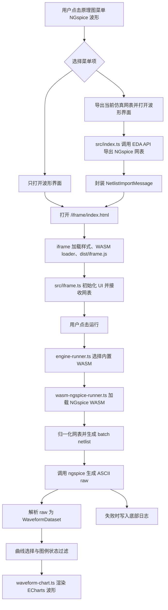

# 源码快速上手指南

本文档用于快速理解 `NGspice 波形仿真` 插件的源码结构、运行流程和编译打包方法。适合第一次接手代码时先读一遍，再按模块进入源码。

## 项目定位

这是一个嘉立创 EDA 专业版扩展插件，当前版本为 `V1.2.1`。

插件做三件事：

- 从嘉立创 EDA 原理图中导出 NGspice 仿真网表。
- 在插件 iframe 页面中导入、粘贴或接收网表，并用内置 NGspice WASM 在浏览器本地运行仿真。
- 将 transient、AC、DC 仿真结果解析为统一数据结构，并用 ECharts 绘制波形。

当前路线是纯 WASM 内置方案，不依赖用户额外下载或常驻启动本地原生 NGspice 服务。

## 目录结构

```text
easyeda-ngspice-waveform-plugin/
├─ extension.json              # 嘉立创 EDA 扩展清单，定义插件名、菜单、入口、版本等
├─ package.json                # Node 依赖和构建脚本
├─ README.md                   # 扩展广场详情页 README，包含功能图和演示 GIF
├─ CHANGELOG.md                # 版本更新记录
├─ LICENSE                     # 许可说明
├─ .edaignore                  # 打包 .eext 时排除的文件规则
├─ src/                        # TypeScript 源码，打包后输出到 dist/
│  ├─ index.ts                 # 插件主入口，注册菜单动作、打开 iframe、导出 EDA 仿真网表
│  ├─ iframe.ts                # 波形界面主逻辑，包含 UI、导入、运行、日志、曲线选择
│  ├─ engine-runner.ts         # 仿真运行入口，目前只走内置 WASM
│  ├─ wasm-ngspice-runner.ts   # NGspice WASM 加载、运行、raw 文件解析
│  ├─ messages.ts              # 插件主入口和 iframe 之间的 MessageBus topic 与消息类型
│  └─ shared/
│     ├─ types.ts              # 波形数据结构定义
│     ├─ netlist.ts            # 网表识别、分析命令提取、AC 单位兼容、节点推断
│     ├─ ngspice-normalize.ts  # 旧协议/外部消息归一化工具，保留给兼容层使用
│     └─ waveform-chart.ts     # ECharts 波形封装、缩放、拖拽、下采样、坐标轴格式化
├─ iframe/
│  ├─ index.html               # iframe 页面壳，加载 CSS、WASM loader 和 dist/iframe.js
│  ├─ styles.css               # 波形界面样式
│  └─ wasm/
│     ├─ ngspice.js            # Emscripten 生成的 NGspice JS loader
│     ├─ ngspice.wasm          # 原始 WASM 文件
│     ├─ ngspice-wasm-binary.js# WASM base64 内嵌文件，解决 iframe 拉取 .wasm 失败问题
│     ├─ ngspice-global.js     # 将 loader 暴露到全局的辅助脚本
│     └─ WASM-NOTES.md         # WASM 资源说明，避免非根目录 README 影响详情页解析
├─ images/
│  ├─ logo.png                 # 扩展广场 LOGO
│  ├─ feature-overview.png     # README 功能图
│  └─ demo.gif                 # README 功能演示 GIF
├─ config/
│  ├─ esbuild.common.ts        # esbuild 公共配置
│  └─ esbuild.prod.ts          # 构建入口
├─ build/
│  ├─ packaged.ts              # 读取 .edaignore 并生成 .eext 包
│  └─ dist/                    # 输出的 .eext 扩展包
├─ dist/                       # TypeScript 编译后的浏览器 JS
└─ tools/                      # 历史本地启动器方案保留文件，目前主流程不依赖
```

## 关键入口

### `extension.json`

这是扩展被嘉立创 EDA 识别的入口文件。

重点字段：

- `name`：发布包名，目前为 `runlong-ngspice-waveform`。
- `uuid`：扩展唯一 ID，发布同一个插件时不要随意改。
- `version`：扩展版本，目前为 `1.2.1`。
- `entry`：插件 JS 入口，目前为 `./dist/index`。
- `headerMenus.sch`：原理图页面顶部菜单。
- `images.logo`：扩展广场 LOGO。

菜单目前有两个动作：

- `ImportSimulationNetlistToWaveform`：导出当前仿真网表并打开波形界面。
- `OpenWaveformPanel`：只打开波形界面，用户可手动导入或粘贴网表。

### `src/index.ts`

插件主入口，运行在嘉立创 EDA 插件上下文中。

负责：

- `activate()`：插件激活时注册 MessageBus RPC。
- `openWaveformPanel()`：打开 iframe 波形窗口。
- `importSimulationNetlistToWaveform()`：调用 EDA API 导出 NGspice 仿真网表。
- 将导出的网表封装成 `NetlistImportMessage`，通过 MessageBus 发给 iframe。

关键 EDA API：

```ts
eda.sch_ManufactureData.getSimulationNetlistFile(...)
eda.sys_IFrame.openIFrame(...)
eda.sys_MessageBus.publishPublic(...)
eda.sys_MessageBus.rpcServicePublic(...)
```

### `src/iframe.ts`

波形界面主逻辑，运行在 `/iframe/index.html` 页面里。

负责：

- 渲染完整 UI：顶部工具栏、左侧网表编辑器、右侧波形图、底部日志。
- 支持本地文件导入、示例网表、粘贴网表。
- 接收主插件通过 MessageBus 发送的仿真网表。
- 点击运行后调用 `runNgspiceNetlist()`。
- 根据仿真结果维护 `currentResult`、`activeDatasetId`、`traceSelection`。
- 弹出曲线选择框，控制哪些节点或电流曲线显示。
- 将选中的数据交给 `WaveformChart` 绘图。

如果要改界面布局、按钮、弹窗、日志显示，优先看这个文件和 `iframe/styles.css`。

### `src/engine-runner.ts`

仿真入口层。它屏蔽具体引擎实现，给 iframe 一个稳定接口：

```ts
runNgspiceNetlist(netlist): Promise<SimulationResponse>
getEngineStatus(): Promise<RunnerStatus>
```

当前实现只使用插件内置 WASM：

```ts
runNgspiceNetlistWithWasm(netlist, {
  wasmBaseUrl: '/iframe/wasm',
  timeoutMs: 60_000,
})
```

如果以后要切换到云端、原生本地服务或多引擎策略，可以先改这里。

### `src/wasm-ngspice-runner.ts`

这是仿真核心。

主要步骤：

1. 检查或加载 `ngspice.js`。
2. 从 `ngspice-wasm-binary.js` 读取内嵌 WASM 二进制。
3. 调用 `normalizeNetlistForNgspice()` 兼容 AC 频率写法，例如 `1M` 转为 `1Meg`。
4. 生成批处理网表：

```spice
.control
set filetype=ascii
set plotwinsize=0
run
write /tmp/.../result.raw all
quit
.endc
.end
```

5. 写入 Emscripten 虚拟文件系统。
6. 调用 `module.callMain(["-b", "-o", logPath, inputPath])` 执行 ngspice。
7. 读取 ASCII raw 波形文件。
8. 解析 raw 中的变量、数据行和复数结果。
9. 转换为前端统一的 `WaveformDataset[]`。

如果遇到“仿真能跑但没有波形”或“AC/DC 数据解析不对”，优先看这个文件。

### `src/shared/waveform-chart.ts`

ECharts 封装层。

负责：

- transient、AC、DC 不同坐标轴配置。
- 电压左轴、电流右轴。
- 图例颜色、曲线颜色、tooltip。
- 鼠标位置缩放。
- 绘图区横轴缩放，电压/电流轴区域纵轴缩放。
- 拖拽平移。
- 自适应视图。
- 大数据窗口渲染和保峰值下采样。
- 坐标轴最多 5 位有效显示。

如果要改波形显示效果、缩放逻辑、刻度格式、颜色、图例，优先看这个文件。

## 运行流程

### 流程图



### 数据结构流转

主插件导出的网表消息：

```ts
interface NetlistImportMessage {
  type: 'simulation-netlist';
  source: 'EasyEDA Pro' | 'local-file' | 'paste';
  fileName: string;
  netlist: string;
  analysisType: AnalysisType;
  command: string;
  lineCount: number;
  importedAt: number;
}
```

仿真结果统一结构：

```ts
interface SimulationResult {
  datasets: WaveformDataset[];
  activeDatasetId: string | null;
}

interface WaveformDataset {
  id: string;
  analysisType: 'transient' | 'ac' | 'dc';
  title: string;
  command: string;
  xAxis: WaveformAxis;
  yAxes: WaveformAxis[];
  traces: WaveformTrace[];
  meta: {
    simulationId: string;
    sampleCount: number;
    generatedAt: number;
    sourcePlot?: string;
  };
}

interface WaveformTrace {
  id: string;
  name: string;
  axisId: string;
  unit: string;
  points: Array<[number, number]>;
  color?: string;
}
```

前端只依赖 `SimulationResult` 和 `WaveformDataset`，不要让 UI 直接依赖 NGspice raw 文件格式。

## 编译和打包

### 环境要求

- Node.js `>=20.17.0`
- npm
- 嘉立创 EDA 专业版 `>=3.3.0`

依赖中有一个本地包：

```json
"@jlceda/pro-api-types": "file:../pro-api-types/package"
```

如果重新安装依赖时提示找不到这个包，需要确认项目上一级目录存在：

```text
C:/Users/win/Desktop/EDA test/pro-api-types/package
```

### 安装依赖

```bash
npm install
```

### 类型检查

```bash
npx tsc --noEmit
```

### 编译浏览器 JS

```bash
npm run compile
```

输出：

```text
dist/index.js
dist/iframe.js
```

### 生成 `.eext` 发布包

```bash
npm run build
```

构建过程：

1. 执行 `npm run compile`。
2. 运行 `build/packaged.ts`。
3. 读取 `.edaignore` 排除源码、依赖、临时目录等。
4. 将剩余文件压缩为 `.eext`。

当前输出位置：

```text
build/dist/runlong-ngspice-waveform_v1.2.1.eext
```

### 打包时会排除什么

由 `.edaignore` 控制，当前会排除：

```text
/.git/
/.vscode/
/build/
/config/
/node_modules/
/src/
/.gitignore
/.edaignore
/package-lock.json
/package.json
/tsconfig.json
debug.log
*.tsbuildinfo
launcher-config.json
tools/launcher-config.json
```

注意：`.eext` 包中不会包含 `src/` 源码，只包含编译后的 `dist/`、iframe 静态资源、README、图片和扩展清单。

## 发布包应包含的关键文件

发布审核时重点检查这些文件：

```text
extension.json
README.md
CHANGELOG.md
LICENSE
dist/index.js
dist/iframe.js
iframe/index.html
iframe/styles.css
iframe/wasm/ngspice.js
iframe/wasm/ngspice-wasm-binary.js
iframe/wasm/ngspice-global.js
images/logo.png
images/feature-overview.png
images/demo.gif
```

根目录外不要出现 `README.md`，否则扩展详情页可能解析错误。非根目录说明文档请使用类似 `WASM-NOTES.md`、`TOOLS-NOTES.md` 的名字。

## 常见修改点

### 修改插件名称、版本、描述

改这些文件：

- `extension.json`
- `package.json`
- `README.md`
- `CHANGELOG.md`

版本号需要保持一致，否则打包文件名和市场展示容易混乱。

### 修改顶部菜单

看 `extension.json` 的 `headerMenus.sch`，再到 `src/index.ts` 增加对应导出函数。

### 修改波形界面布局

主要看：

- `src/iframe.ts`
- `iframe/styles.css`

### 修改仿真执行逻辑

主要看：

- `src/engine-runner.ts`
- `src/wasm-ngspice-runner.ts`

### 修改网表识别和兼容规则

主要看：

- `src/shared/netlist.ts`

例如 AC 分析的 `1M` 转 `1Meg` 就在这里处理。

### 修改 raw 解析逻辑

主要看：

- `src/wasm-ngspice-runner.ts`

关键函数：

- `parseAsciiRaw()`
- `parseRawPlot()`
- `parseRawRows()`
- `parseRawScalar()`
- `plotToDatasets()`

### 修改波形缩放、坐标轴、图例、颜色

主要看：

- `src/shared/waveform-chart.ts`

关键内容：

- `TRACE_PALETTE`
- `WaveformChart`
- `computeView()`
- `fitXToDataBounds()`
- `zoomRange()`
- `panRange()`
- `constrainXView()`
- `downsamplePreserveExtremes()`
- `formatAxisTickValue()`

## 调试建议

### 先确认网表是否有效

如果日志里出现类似：

```text
Unable to find definition of model
Simulation interrupted due to error!
ngspice WASM 未生成 raw 波形文件
```

通常说明网表里的模型、子电路或器件定义缺失，不是绘图层问题。

### 判断问题在哪一层

- 菜单打不开：看 `extension.json` 和 `src/index.ts`。
- 网表导不出来：看 `src/index.ts` 里的 `getSimulationNetlistFile()`。
- iframe 没收到网表：看 `messages.ts` 的 topic 和 `src/iframe.ts` 的 `subscribeToEdaNetlist()`。
- 点击运行失败：看 `engine-runner.ts` 和 `wasm-ngspice-runner.ts`。
- 日志显示 raw 已生成但无曲线：看 raw 解析。
- 曲线有数据但显示异常：看 `waveform-chart.ts`。

### 运行日志很重要

底部日志会记录：

- 网表导入来源。
- 识别到的 `.tran`、`.ac`、`.dc` 命令。
- WASM loader 是否加载成功。
- 是否使用内嵌 WASM 二进制。
- NGspice stdout/stderr 的关键行。
- raw 解析到多少组结果和多少条曲线。

遇到问题优先复制日志判断。

## 当前已知限制

- 只支持纯 NGspice 网表文本。
- 不负责把非 NGspice 工程文件转换成 NGspice 网表。
- WASM 构建已启用 XSPICE，暂未启用 CIDER、OSDI、OpenMP、KLU。
- 大型电路或长时间仿真受浏览器内存和单线程性能影响。
- `tools/` 里的本地启动器方案是历史方案，目前主流程不依赖。

## 建议的阅读顺序

第一次接手建议按这个顺序读：

1. `extension.json`：知道插件怎么挂到 EDA 菜单上。
2. `src/index.ts`：知道网表怎么从 EDA 导出，iframe 怎么打开。
3. `src/iframe.ts`：知道界面状态和按钮事件怎么组织。
4. `src/engine-runner.ts`：知道仿真入口怎么封装。
5. `src/wasm-ngspice-runner.ts`：知道 WASM ngspice 怎么跑、raw 怎么解析。
6. `src/shared/types.ts`：知道前端统一数据结构。
7. `src/shared/waveform-chart.ts`：知道波形怎么显示、缩放和下采样。
8. `iframe/styles.css`：最后再看样式细节。

## 快速命令备忘

```bash
# 安装依赖
npm install

# 类型检查
npx tsc --noEmit

# 只编译 dist/index.js 和 dist/iframe.js
npm run compile

# 编译并打包 .eext
npm run build
```

打包完成后查看：

```text
build/dist/runlong-ngspice-waveform_v1.2.1.eext
```
