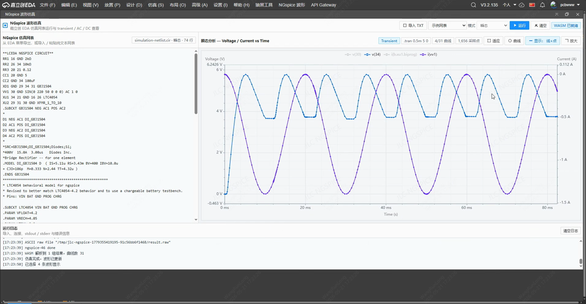
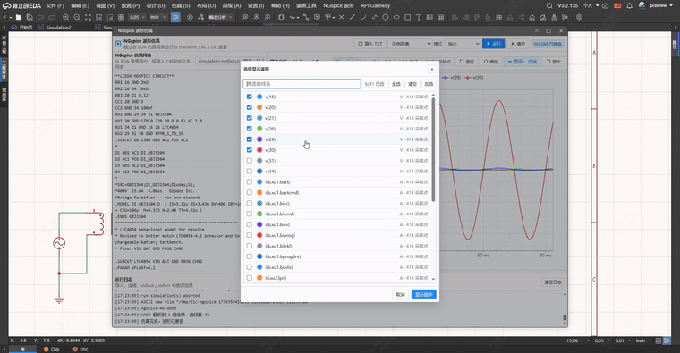

# NGspice 波形仿真

版本：V1.2.1

作者：LCEDA

许可：NGspice License (Modified BSD)

NGspice 波形仿真是一款面向嘉立创 EDA 专业版的本地仿真与波形查看插件。插件可接收 EDA 仿真事件传入的 NGspice 网表与探针信息，也支持在波形界面中直接粘贴或导入纯 NGspice 网表文本，并使用插件内置的真实 NGspice WASM 引擎在本地浏览器内完成仿真与波形分析。

## 功能图

## 功能演示

## 核心功能

- EDA 仿真事件触发后自动打开波形界面、导入网表与探针并运行仿真。
- 支持手动导入 `.txt` / `.cir` / `.net` / `.spice` 网表，或直接复制粘贴网表内容。
- 使用插件内置 NGspice WASM 运行，无需用户额外下载或常驻启动本地仿真服务。
- 支持 transient、AC、DC 三类仿真结果解析与波形渲染。
- 支持接收 EDA 仿真事件携带的电压 / 电流探针信息，仿真完成后按探针节点名自动默认选中对应波形，减少手动筛选曲线。
- 支持识别网表中的 `XAM` 电流探针，自动补充探针两端电压保存项，并按两端压差合成电流曲线。
- 支持多曲线图例开关、曲线选择弹窗、按鼠标位置缩放、拖拽平移和波形全屏观察。
- 自适应视图按当前未隐藏曲线计算范围，并限制横轴在有效数据边界内，减少无数据空白。
- 大数据波形显示会优先渲染当前窗口内的数据；缩小时使用保峰值下采样，放大到局部后恢复更多原始细节。
- AC 分析兼容常见 `1M` / `10M` 频率写法，运行前会自动转换为 ngspice 识别的 `1Meg` / `10Meg`。
- 对同一份 EDA 网表消息做去重处理，避免重复广播在仿真完成后清空刚生成的波形；曲线选择弹窗会在图表刷新后稳定打开。
- 运行失败时在底部日志区显示 NGspice 输出、错误原因和关键诊断信息。

## 使用方式

1. 在原理图编辑器中触发 EDA 仿真事件后，插件会自动打开波形界面。
2. 插件自动导入事件中的网表与探针信息，并立即运行仿真。
3. 仿真完成后，探针对应曲线会默认选中并显示。
4. 如需自定义网表，可在原理图页面点击 `NGspice 波形` -> `打开波形界面` 后手动导入 / 粘贴网表。

## 支持的数据

- 瞬态分析：`.tran`，横轴为时间，支持电压 / 电流双轴显示。
- AC 分析：`.ac`，横轴为频率，支持增益 dB 与相位 deg 显示。
- DC 扫描：`.dc`，横轴为扫描变量，支持电压 / 电流曲线显示。
- EDA 探针：支持按 `probeNodes` 中的节点名匹配已有电压曲线，并将匹配结果作为默认显示曲线。
- 电流探针：支持识别 `XAM` 探针形式，基于两端电压差合成电流波形。

## 运行环境

- 嘉立创 EDA 专业版 3.3.0 或更高版本。
- 插件内置 NGspice 46 WASM 构建。
- 仿真在本机插件 iframe 中执行，不上传网表文件路径或仿真结果。

## 已知限制

- V1.2.1 仅支持纯 NGspice 网表文本，不处理非 NGspice 格式的工程文件转换。
- 仿真能力以当前内置 NGspice WASM 构建为准，已启用 XSPICE，暂未启用 CIDER、OSDI、OpenMP、KLU。
- 大型电路或长时间仿真会受浏览器内存和单线程执行时间影响。
