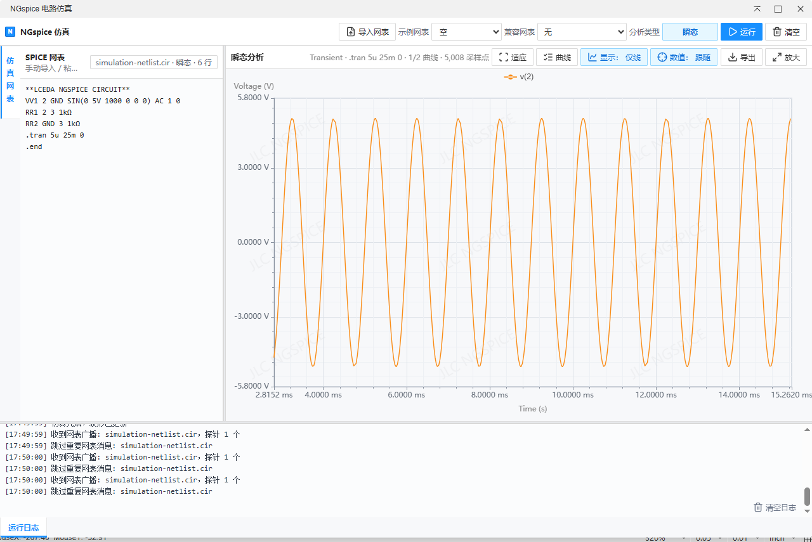
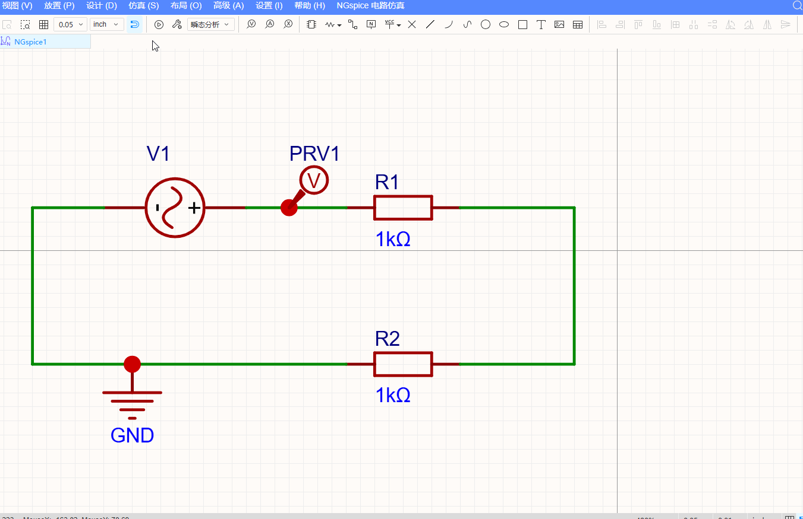
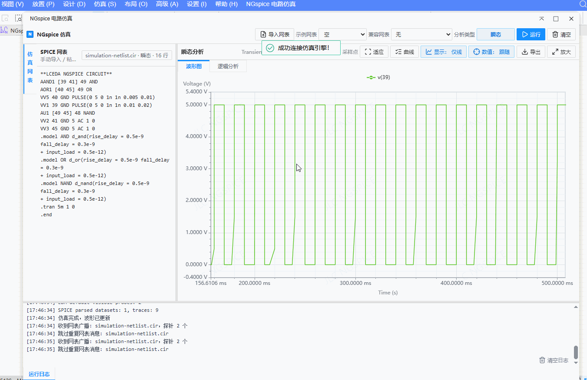

# NGspice 仿真

版本：V1.9.1

作者：LCEDA

许可：BSD-3-Clause

第三方许可：插件包内置 ngspice WASM、ECharts 和 zrender。相关许可文本见 `THIRD_PARTY_NOTICES.md`、`licenses/` 和 `iframe/wasm/NGSPICE-COPYING.txt`。

NGspice 仿真是一款面向嘉立创 EDA 专业版的本地仿真与波形查看插件。插件可接收 EDA 仿真事件传入的 NGspice 网表与探针信息，也支持在波形界面中直接粘贴或导入纯 NGspice 网表文本，并使用插件内置的真实 NGspice WASM 引擎在本地浏览器内完成仿真与波形分析。

## 功能图

## 功能演示

## 核心功能

### 仿真引擎

- 内置 NGspice，在本地浏览器内完成仿真，无需额外下载或常驻本地仿真。
- 支持 transient、AC、DC 三类标准仿真结果解析与波形渲染。
- 逻辑分析图谱：XSPICE 数字节点与逻辑探针的 0/1/U 时序图，数字与模拟数据自动分流到逻辑图和波形图，逻辑探针指向模拟节点时按电平阈值转换。
- 兼容网表：LTspice / PSpice / HSPICE 模式下拉选择，导入网表时自动带入。

### 蒙特卡洛与最坏情况分析

- 蒙特卡洛分析：样本实时上屏，千条样本波形叠加时缩放平移保持流畅。
- 统计摘要与直方图：输出各测量值的均值、标准差、分位数与良率；直方图支持计数 / 百分比两种显示并标注均值与规格上下限；点击样本可在波形叠加图中高亮定位，明细可导出。
- 最坏情况分析：从网表测量自动识别参数与容差边界，按参数灵敏度合成 Worst Low / Worst High 最坏组合；提供 corner 摘要、参数影响与运行明细表，标称与最坏三条波形叠加显示。

### 波形交互

- 多曲线图例开关、曲线选择弹窗、按鼠标位置缩放、拖拽平移和波形全屏观察。
- 数值线支持鼠标跟随与固定游标两种模式：仅线模式插值连续跟随，点/线点模式对齐最近采样点；固定游标可拖动、支持按横轴单位输入定位；交点圆点始终压在屏幕折线上，缩放平移期间不漂移。
- 大数据优先渲染当前窗口内的数据，缩小时保峰值下采样；渲染点数按曲线数均摊预算，大量曲线叠加时保持流畅。
- 自适应视图按当前未隐藏曲线计算范围，横轴限制在有效数据边界内，减少无数据空白。

### 数据导入与导出

- EDA 仿真事件触发后自动打开波形界面、导入网表与探针并运行仿真，完成后探针对应曲线默认选中。
- 支持手动导入 `.txt` / `.cir` / `.net` / `.spice` 网表，或直接复制粘贴网表内容。
- 识别网表中的 `XAM` 电流探针，自动补充两端电压保存项，按压差合成电流曲线。
- 支持导出各分析类型的完整波形数据：单数据集生成 CSV，多数据集生成包含逐数据集 CSV 的 ZIP。

### 兼容与体验

- AC 分析兼容常见 `1M` / `10M` 频率写法，运行前自动转换为 ngspice 识别的 `1Meg` / `10Meg`。
- 对同一份 EDA 网表消息去重，避免重复广播清空刚生成的波形；曲线选择弹窗在图表刷新后稳定打开。
- 运行失败时在底部日志区显示 NGspice 输出、错误原因和关键诊断信息。
- 简体中文与英文界面，跟随 EDA 当前语言并响应运行时切换；工具栏在画布变窄时横向滚动。

## 使用方式

1. 在原理图编辑器中触发 EDA 仿真事件后，插件会自动打开波形界面。
2. 插件自动导入事件中的网表与探针信息，并立即运行仿真。
3. 仿真完成后，探针对应曲线会默认选中并显示。
4. 如需自定义网表，可在原理图页面点击 `NGspice 波形` -> `打开波形界面` 后手动导入 / 粘贴网表。

## 支持的数据

- 瞬态分析：`.tran`，横轴为时间，支持电压 / 电流双轴显示。
- AC 分析：`.ac`，横轴为频率，支持增益 dB 与相位 deg 显示。
- DC 扫描：`.dc`，横轴为扫描变量，支持电压 / 电流曲线显示。
- 蒙特卡洛分析：随机参数逐样本重采样统计，测量值可声明规格上下限并计算良率。
- 最坏情况分析：参数灵敏度扫描与 Worst Low / Worst High 最坏组合波形对比。
- 逻辑分析：数字节点事件数据转 0/1/U 时序，逻辑探针可指向模拟节点按阈值转换。
- EDA 探针：支持eda内探针匹配已有曲线，并将匹配结果作为默认显示曲线。
- 电流探针：支持识别 `XAM` 探针形式，基于两端电压差合成电流波形。
- 兼容网表：支持 PSpice（psa）、LTspice（lta）、HSPICE（hsa）及组合模式。

## 运行环境

- 嘉立创 EDA 专业版 4.1 或更高版本。
- 插件内置 NGspice 46 WASM 构建。
- 仿真在本机插件 iframe 中执行，不上传网表文件路径或仿真结果。

## 开发结构说明

详细源码分层、根目录职责、`build/` 与 `wasm-build/` 的区别见 `CODEBASE_GUIDE.md`。

简要规则：

- `src/` 和 `iframe/styles/` 是插件业务与界面源码。
- `build/` 是插件打包、临时 harness 和 `.eext` 输出目录。
- `wasm-build/` 是 ngspice WASM 编译脚本与 wrapper 源码目录。
- `wasm-lib/` 是 ngspice WASM 编译后的中间产物，最终运行资源会同步到 `iframe/wasm/`。
- `build/ngspice-wasm-kit/` 如本地存在，只是早期可移植 WASM 构建资料包快照，不是当前主构建入口。

## 已知限制

- V1.9.1 仅支持网表文本输入：兼容 LTspice / PSpice / HSPICE 方言语法（ngbehavior），但不支持导入原理图工程文件（如 `.sch` / `.asc`），方言特有语法也不保证全部解析。
- 仿真能力以当前内置 NGspice WASM 构建为准，已启用 XSPICE，暂未启用 CIDER、OSDI、OpenMP、KLU。
- 大型电路或长时间仿真会受浏览器内存和单线程执行时间影响。

## 致谢

- **NGspice 项目**（[ngspice.sourceforge.io](https://ngspice.sourceforge.io/)）- 感谢提供开源 SPICE 电路仿真核心与 XSPICE 扩展能力。
- **Emscripten 团队** - 让 NGspice C/C++ 代码能够以 WebAssembly 形式在浏览器中运行。
- **Apache ECharts 项目**（[echarts.apache.org](https://echarts.apache.org/)）- 为波形和逻辑分析图提供可视化渲染能力。
- 所有项目贡献者和开源社区的支持。

## 相关资源

- [NGspice 官方网站](https://ngspice.sourceforge.io/)
- [NGspice 46 用户手册](https://ngspice.sourceforge.io/docs/ngspice-46-manual.pdf)
- [WebAssembly 官方文档](https://webassembly.org/)
- [Emscripten 文档](https://emscripten.org/docs/)
- [Apache ECharts 文档](https://echarts.apache.org/handbook/)
